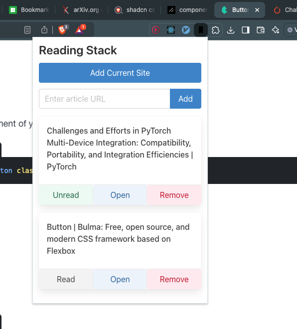

# Reading Stack - Chrome Extension

Reading Stack is a Chrome extension that helps you manage your active reading list with ease. Keep track of articles you want to read, mark them as read, and access them quickly.

Currently this is not published on the Chrome Web Store, but you can install it by following the instructions below. I made it for my use with cursor ai.

## Features

- Add the current page to your reading list with one click
- Manually add articles by URL
- Mark articles as read or unread
- Open articles in a new tab
- Remove articles from your list
- Syncs across devices (when signed into Chrome)

## Screenshot

## Installation

1. Clone this repository or download the ZIP file.
2. Open Chrome and navigate to `chrome://extensions`.
3. Enable "Developer mode" in the top right corner.
4. Click "Load unpacked" and select the directory containing the extension files.

## Usage

1. Click the Reading Stack icon in your Chrome toolbar to open the popup.
2. Use the "Add Current Site" button to quickly add the current page to your list.
3. Alternatively, enter a URL manually and click "Add" to add it to your list.
4. Manage your reading list using the "Read", "Open", and "Remove" buttons for each article.

## Development

To modify or enhance the extension:

1. Edit the HTML in `popup.html` to change the structure.
2. Modify the styles in `custom.css` to adjust the appearance.
3. Update the functionality in `popup.js` to add or change features.
4. If necessary, update the `manifest.json` file to reflect any changes in permissions or metadata.

## Contributing

Contributions are welcome! Please feel free to submit a Pull Request.

## License

This project is open source and available under the [MIT License](LICENSE).

## Credits

- Bookmark icon by [Icons8](https://icons8.com)

## Contact

If you have any questions, feel free to reach out or open an issue.

Happy reading!
